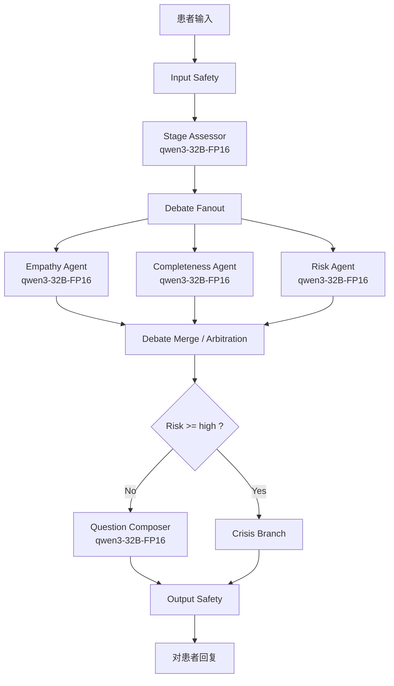

# Psychiatric Triage Debate Agent (LangGraph)

这是一个面向“初筛分诊 + 正式问诊前信息采集”的多智能体 `debate` 骨架工程。  
目标是让患者更愿意开口、症状描述更结构化、时间线更清楚、风险点更容易暴露。

## 框架确认

这个 `debate` 实现使用的是 **LangGraph**，并且包含你要求的 5 个角色:

- `Empathy Agent`（共情）
- `Clinical Completeness Agent`（临床完整性）
- `Risk Review Agent`（风险审查）
- `Question Composer Agent`（最终问题生成）
- `Stage Assessor Agent`（阶段评估）

## 模型映射

**当前配置：全部使用本地 qwen3-32B-FP16**

- `Empathy Agent`: qwen3-32B-FP16
- `Clinical Completeness Agent`: qwen3-32B-FP16
- `Risk Review Agent`: qwen3-32B-FP16
- `Stage Assessor Agent`: qwen3-32B-FP16
- `Question Composer Agent`: qwen3-32B-FP16

## 架构图



## 阶段机

可选阶段:

- `rapport`
- `broad_explore`
- `structured_clarify`
- `risk_probe`
- `hypothesis_test`
- `closure`

硬门槛（代码已实现）:

- 若上一轮 `risk_level` 为 `high/critical`，阶段强制到 `risk_probe`。
- 若模型建议进入 `hypothesis_test`，但 `slot_coverage < 0.8` 或 `timeline_confidence < 0.7`，回退到 `structured_clarify`。
- `risk_level` 到 `high/critical` 时，强制进入 `crisis` 分支，不走普通追问。

## 快速启动（本地 qwen3-32B-FP16）

1. 安装依赖

```bash
pip install -e .
pip install vllm  # 本地推理
```

2. 启动 vLLM 服务（需单独终端，约需 65GB 显存）

```bash
./scripts/start_vllm.sh
```

3. 运行智能体

```bash
./run_local.sh
# 或
./scripts/run.sh
```

环境变量见 `.env`，可调整 `LOCAL_MODEL_PATH`、`LOCAL_MODEL_BASE_URL` 等。

## 代码结构

- `src/psy_debate/schema.py`: 状态与结构化输出 schema
- `src/psy_debate/prompts.py`: 5 个 agent 的系统提示词
- `src/psy_debate/models.py`: 国产模型路由与 JSON 输出解析
- `src/psy_debate/nodes.py`: LangGraph 节点逻辑和风险路由
- `src/psy_debate/graph.py`: 图编排
- `src/psy_debate/main.py`: CLI 演示入口

## 重要说明

- 这是初筛与信息采集助手，不是诊断系统。
- 生产环境建议额外接入平台侧内容安全服务与人工兜底流程。

